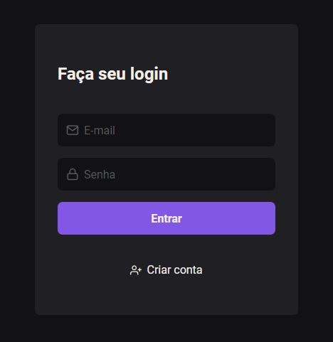

# Explore Stock

Conteúdo extra Explorer - Autenticação e Autorização

## Sobre

Projeto dedicado à autenticação e autorização, por meio de estratégias fundamentais para garantir a segurança de um sistema, além de fortalecer a proteção do site, substituindo o armazenamento de dados sensíveis no localStorage por cookies.

### O projeto

