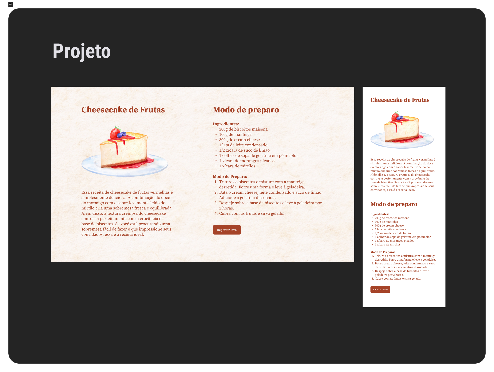
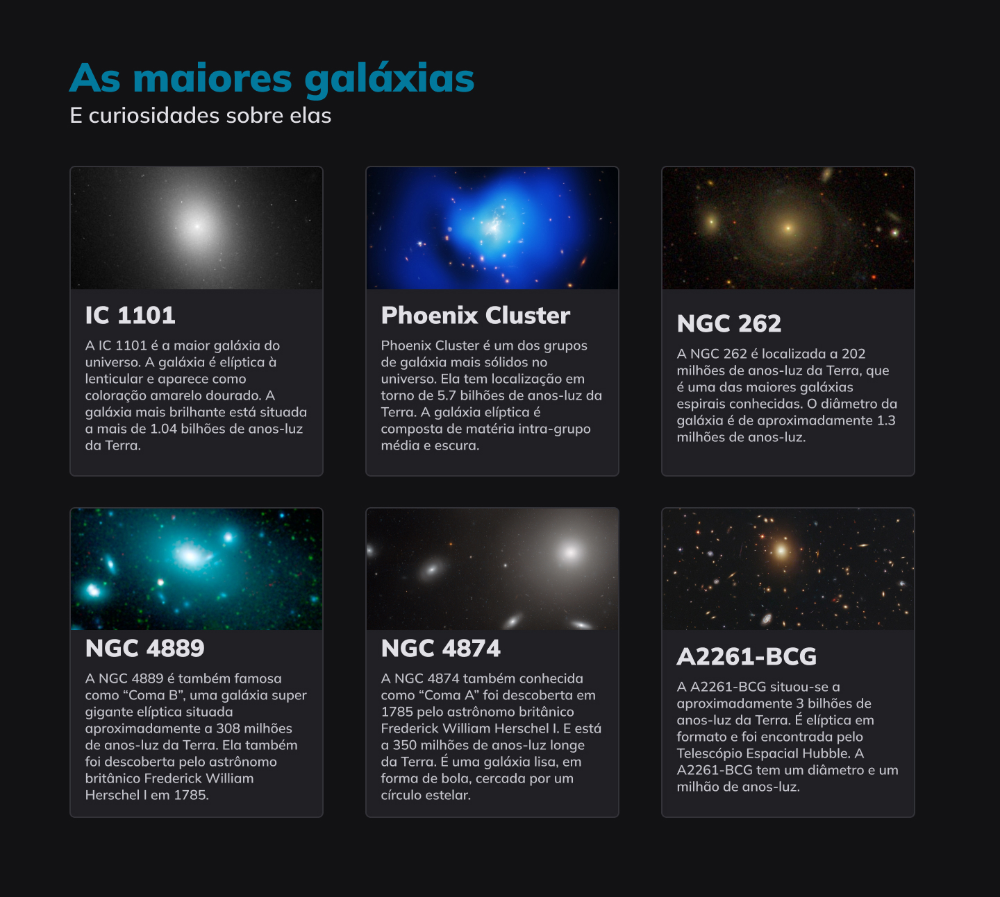

# Explorer Rocketseat

Minha resolução dos projetos e desafios do Explorer da Rocketseat
 
<a href="https://www.rocketseat.com.br" target="_blank">Conheça a Rocketseat</a>

<table align="center">
  <thead>
    <tr>
      <th align="center">
        
Nome

      </th>
      <th align="center">
        
Preview

      </th>
    </tr>
  </thead>
  <tbody>
    <tr>
      <td><a href="Projeto01">Projeto 01</a></td>
      <td align="center"></td>
    </tr>
    <tr>
      <td><a href="RecriandoLayout01">(Desafio) Recriando Layout 01</a></td>
      <td align="center"></td>
    </tr>
    <tr>
      <td><a href="Projeto02">Projeto 02</a></td>
      <td align="center"></td>
    </tr>
    <tr>
      <td><a href="RecriandoLayout02">(Desafio) Recriando Layout 02</a></td>
      <td align="center"></td>
    </tr>
    <tr>
      <td><a href="Projeto03">Projeto 03</a></td>
      <td align="center"></td>
    </tr>
    <tr>
      <td><a href="CriandoFormulario01">(Desafio) Criando Formulário 01</a></td>
      <td align="center"></td>
    </tr>
    <tr>
      <td><a href="Projeto04">Projeto 04</a></td>
      <td align="center"></td>
    </tr>
    <tr>
      <td><a href="Cheesecake">Cheesecake</a></td>
      <td align="center"></td>
    </tr>
    <tr>
      <td><a href="Galaxies">Galaxies</a></td>
      <td align="center"></td>
    </tr>
    <tr>
      <td><a href="Fotoblog">Fotoblog</a></td>
      <td align="center"></td>
    </tr>
    <tr>
      <td><a href="CriandoFormulario02">(Desafio) Criando Formulário 02</a></td>
      <td align="center"></td>
    </tr>
    <tr>
      <td><a href="BlogDeGatos">(Desafio) Blog de Gatos</a></td>
      <td align="center"></td>
    </tr>
    <tr>
      <td><a href="ExploreSemLimites">(Desafio) Explore sem limites</a></td>
      <td align="center"></td>
    </tr>
  </tbody>
</table>
